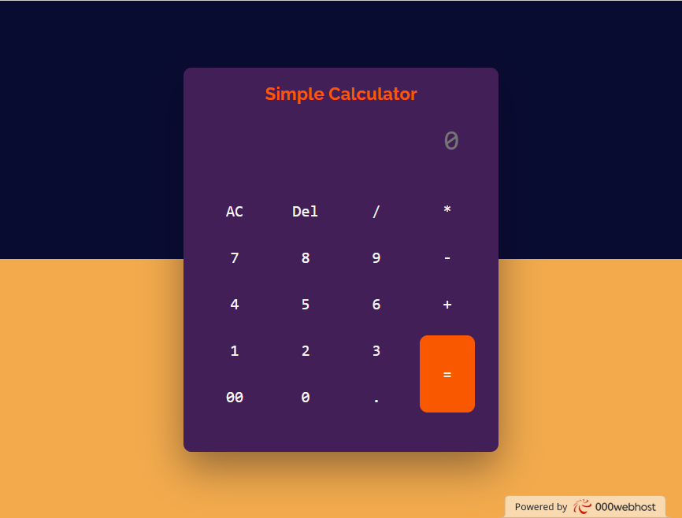

# Simple Calculator

A simple calculator project implemented using HTML, CSS, and JavaScript.



## Description

This project is a basic calculator that performs simple arithmetic operations. It has a user-friendly interface with a display screen to show the input and output.

## Features

- Addition, subtraction, multiplication, and division operations
- Clear button to reset the input
- Erase button to remove the last entered character
- Equal button to calculate the result

## Demo

You can try out the calculator by accessing the [live demo](https://calnum.000webhostapp.com/Calculator/index.html).

## Getting Started

Follow the instructions below to get a copy of the project up and running on your local machine for development and testing purposes.

### Prerequisites

Make sure you have the following installed:

- Web browser

### Installation

1. Clone the repository:

   ```shell
   git clone https://github.com/your-username/simple-calculator.git
   
2. Open the project directory.
3. Double-click on the index.html file to open it in your web browser.

### Usage
• Enter numbers and perform calculations by clicking the respective buttons on the calculator.
• Use the "AC" button to clear the input.
• Use the "Del" button to erase the last entered character.
• Click the "=" button to evaluate the expression and display the result.

### Technologies Used
• HTML
• CSS
• JavaScript

### Author
Muhammad Awais Akhter

### License
This project is licensed under the MIT License.

Feel free to customize the `README.md` file as per your requirements and add any additional information or sections you deem necessary. Also, don't forget to replace "your-demo-link.com" and "your-username" with the appropriate values in the actual `README.md` file.

